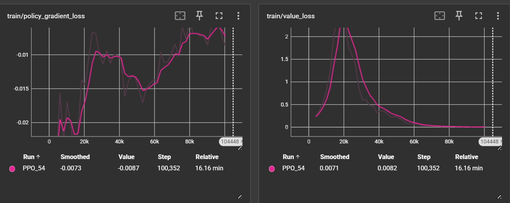
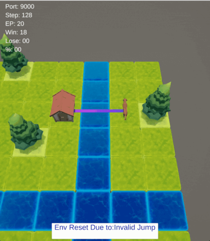

# 🐕 Autonomous Dog Agent - Unity Reinforcement Learning Project

[](https://www.python.org/)
[](https://unity.com/)
[](LICENSE)

A comprehensive Reinforcement Learning (RL) project that trains an autonomous agent (dog) to navigate dynamic Unity environments using Proximal Policy Optimization (PPO). The agent learns to reach randomized targets while avoiding obstacles like hurdles and water hazards through continuous interaction with a Unity-based simulation.

## 📋 Table of Contents

- [Project Overview](#-project-overview)
- [Key Features](#-key-features)
- [Architecture](#-architecture)
- [Technologies](#-technologies)
- [Installation](#-installation)
- [Usage](#-usage)
  - [Command Line Interface](#command-line-interface)
  - [Graphical User Interface](#graphical-user-interface)
- [Project Structure](#-project-structure)
- [Environment Details](#-environment-details)
- [Training Workflow](#-training-workflow)
- [Results & Performance](#-results--performance)
- [Monitoring & Visualization](#-monitoring--visualization)
- [Contributing](#-contributing)
- [License](#-license)

## 🎯 Project Overview

This project implements a complete RL pipeline for training an autonomous navigation agent in Unity. The system uses **Stable-Baselines3** with the **PPO (Proximal Policy Optimization)** algorithm to train a dog agent that can:

- Navigate towards dynamically placed targets
- Avoid obstacles (hurdles and water hazards)
- Make decisions about walking vs. jumping
- Adapt to changing environment configurations

The communication between Unity (C#) and Python is handled via **JSON-RPC** using the `peaceful_pie` library, enabling real-time bidirectional data exchange during training and testing.

## ✨ Key Features

- **🤖 Custom Gymnasium Environment**: Fully compliant Gymnasium environment (`MyEnv`) with proper observation and action spaces
- **🧠 PPO Reinforcement Learning**: State-of-the-art policy gradient algorithm for stable and efficient learning
- **🔄 Multi-Instance Training**: Parallel training across multiple Unity instances for faster convergence
- **📊 TensorBoard Integration**: Real-time training metrics visualization
- **🖥️ GUI Control Center**: User-friendly Flet-based interface for training management
- **👀 Live Observation Viewer**: Real-time monitoring of agent observations and rewards
- **💾 Model Management**: Save, load, and retrain models with ease
- **🎮 Unity Integration**: Seamless Unity-Python communication via RPC

## 🏗️ Architecture

```
┌─────────────────┐         JSON-RPC          ┌──────────────────┐
│   Python RL     │ ◄──────────────────────► │   Unity Engine   │
│   Environment   │      (peaceful_pie)      │   (C# Scripts)    │
│                 │                           │                  │
│  - Gymnasium    │                           │  - Game Logic   │
│  - PPO Agent    │                           │  - Observations │
│  - Training     │                           │  - Rewards      │
└─────────────────┘                           └──────────────────┘
         │
         │ Saves/Loads
         ▼
┌─────────────────┐
│  Model Storage  │
│  (./models/)    │
└─────────────────┘
```

## 🛠️ Technologies

### Core Technologies
- **Python 3.8+**: Main programming language
- **Unity Engine**: Game environment and simulation
- **Gymnasium**: RL environment standard interface
- **Stable-Baselines3**: PPO implementation and RL utilities
- **peaceful_pie**: Unity-Python RPC communication library

### Supporting Libraries
- **Flet**: Cross-platform GUI framework for the control center
- **TensorBoard**: Training metrics visualization
- **PyQt5**: Alternative observation viewer
- **NumPy**: Numerical computations
- **Pandas**: Data handling for logs

## 📦 Installation

### Prerequisites

- Python 3.8 or higher
- Unity 2021 or higher (for building the game)
- Windows OS (current build is Windows-specific)

### Step 1: Clone the Repository

```bash
git clone <repository-url>
cd PythonXUnityProject
```

### Step 2: Install Python Dependencies

```bash
pip install -r requirements.txt
```

Or install manually:

```bash
pip install gymnasium stable-baselines3 peaceful-pie flet matplotlib numpy pandas tensorboard tensorflow PyQt5
```

### Step 3: Unity Setup

1. Ensure the Unity game executable is located at `./GameFiles/Autonomous Dog Agent.exe`
2. The Unity project should have RPC server configured on the default port `9000`
3. Unity scripts should expose `Reset()` and `Step(action)` methods with `[JsonRpcMethod]` attributes

## 🚀 Usage

### Command Line Interface

#### 1. Training a New Model

Train a new PPO model from scratch:

```bash
python train_rl.py --model MyNewModel --episodes 100000 --port 9000
```

**Parameters:**
- `--model`: Name for the saved model (default: `PPO_Test_Model_1`)
- `--episodes`: Number of training timesteps (default: `100000`)
- `--port`: RPC communication port (default: `9000`)

#### 2. Testing a Trained Model

Test a trained model's performance:

```bash
python test_rl.py --model MyNewModel --episodes 50 --port 9000
```

**Parameters:**
- `--model`: Name of the model to test (required)
- `--episodes`: Number of test episodes (default: `100000`)
- `--port`: RPC communication port (default: `9000`)

#### 3. Retraining an Existing Model

Continue training an existing model:

```bash
python retrain.py --model MyNewModel --episodes 50000 --port 9000
```

**Parameters:**
- `--model`: Name of the model to retrain (default: `PPO_HardEnv`)
- `--episodes`: Additional training timesteps (default: `50000`)
- `--port`: RPC communication port (default: `9000`)

#### 4. Multi-Instance Training

Train using multiple Unity instances in parallel (faster training):

```bash
python autorun.py --model MyNewModel --episodes 50000 --buildPath "./GameFiles/Autonomous Dog Agent.exe"
```

**Parameters:**
- `--model`: Model name to train/retrain (default: `PPO_Test_Model_1`)
- `--episodes`: Training timesteps (default: `50000`)
- `--buildPath`: Path to Unity executable (default: `./GameFiles/Autonomous Dog Agent.exe`)

**Note:** This script automatically launches 3 Unity instances on ports `17000`, `17010`, and `17020`.

### Graphical User Interface

Launch the GUI control center:

```bash
flet run app.py
```

**Features:**
- Select training/testing scripts
- Configure model names, episodes, and ports
- Browse and select Unity executable
- Launch/close Unity game instances
- View live observations and rewards
- Monitor training logs in real-time
- Refresh and select from saved models

**Workflow:**
1. Click "🎮 Launch Game" to start Unity
2. Select script type (train/test/retrain/autorun)
3. Configure parameters (model name, episodes, port)
4. Click "▶ Run" to start training/testing
5. Monitor progress in the logs and observation panels

## 📁 Project Structure

```
PythonXUnityProject/
│
├── app.py                      # Flet GUI control center
├── train_rl.py                 # Train new PPO model
├── test_rl.py                  # Test trained model
├── retrain.py                  # Continue training existing model
├── autorun.py                  # Multi-instance parallel training
├── my_env.py                   # Custom Gymnasium environment
├── ObsViewer.py                # PyQt5 observation viewer
├── TF_Launcher.py              # TensorBoard launcher
├── requirements.txt            # Python dependencies
│
├── GameFiles/                  # Unity game build
│   └── Autonomous Dog Agent.exe
│
├── models/                     # Saved PPO models
│   ├── PPO_Test_Model_1.zip
│   └── ...
│
├── logs/                       # Training logs (CSV)
│   └── models/
│
├── tensorboard/                # TensorBoard event files
│   └── PPO_*/
│
└── Helpers/                    # Utility scripts
    └── ppotuner.py
```

## 🎮 Environment Details

### Observation Space

The agent receives a dictionary observation containing:

- **`myPosition`**: `[x, y, z]` - Current agent position (3D coordinates)
- **`targetPos`**: `[x, y, z]` - Target position to reach (3D coordinates)
- **`hurdleBools`**: `[bool, bool, bool, bool]` - Obstacle presence in 4 directions (North, South, West, East)
- **`waterBools`**: `[bool, bool, bool, bool]` - Water hazard presence in 4 directions

### Action Space

Multi-discrete action space: `[action_type, direction]`

- **`action_type`**: `0` = walk, `1` = jump
- **`direction`**: `0` = north, `1` = south, `2` = west, `3` = east

**Total Actions**: 8 possible combinations (2 action types × 4 directions)

### Reward Structure

Rewards are calculated in Unity based on:
- Distance to target (closer = higher reward)
- Collision penalties
- Success bonuses
- Time/step penalties

### PPO Hyperparameters

Default configuration (can be modified in `train_rl.py`):

```python
learning_rate = 3e-4
n_steps = 2048
batch_size = 512
gamma = 0.99
gae_lambda = 0.95
clip_range = 0.2
ent_coef = 0.01
vf_coef = 0.5
max_grad_norm = 0.5
```

## 🔄 Training Workflow

### Recommended Workflow

1. **Initial Training**
   ```bash
   python train_rl.py --model MyModel --episodes 100000
   ```

2. **Evaluate Performance**
   ```bash
   python test_rl.py --model MyModel --episodes 50
   ```

3. **Continue Training** (if needed)
   ```bash
   python retrain.py --model MyModel --episodes 50000
   ```

4. **Accelerate with Multi-Instance** (for faster training)
   ```bash
   python autorun.py --model MyModel --episodes 100000
   ```

### Model Files

- Models are saved in `./models/` directory as `.zip` files
- Each model contains the complete PPO policy network
- Models can be loaded and retrained indefinitely

## 📈 Results & Performance

### Training Results

The agent demonstrates significant learning progress through training. Below are key performance metrics and results from various training runs:

#### Model Performance Summary

| Model Name | Training Episodes | Average Reward | Success Rate | Notes |
|------------|-------------------|----------------|--------------|-------|
| `goodmodel` | ~100+ episodes | ~1.0-11.7 | High | Well-trained model with consistent positive rewards |
| `demov4` | ~950+ episodes | Improving | Learning | Early training phase, rewards improving over time |
| `PPO_Test_Model_1` | 100,000+ | Variable | Good | Baseline model for testing |

#### Reward Progression

Based on training logs, the agent shows clear learning progression:

- **Initial Phase**: Negative rewards (-1.0 to -0.8) as agent explores randomly
- **Learning Phase**: Gradual improvement with rewards ranging from 0.1 to 1.5
- **Optimized Phase**: Consistent positive rewards (1.0-12.0) indicating successful navigation

#### Sample Training Metrics

From `goodmodel.monitor.csv`:
- **Best Episode Reward**: 11.9
- **Average Episode Length**: 6-12 steps
- **Reward Range**: -0.8 to 11.9
- **Success Episodes**: Majority of episodes show positive rewards after initial training

From `demov4.monitor.csv`:
- **Training Episodes**: 950+ episodes logged
- **Reward Trend**: Improving from negative to positive values
- **Learning Curve**: Steady progression visible in log data

### Visual Results

The following visualizations demonstrate the training progress and agent behavior:

#### Training Performance Graph


*Training metrics visualization showing the learning progress of the PPO agent over time. The graph displays key performance indicators such as episode rewards, episode lengths, and training convergence.*

#### Agent Navigation Demonstration


*Animated demonstration of the autonomous dog agent navigating towards its target (home) using the trained PPO model. The agent successfully demonstrates learned behaviors including obstacle avoidance and efficient pathfinding.*

### Key Achievements

✅ **Successful Navigation**: Agent learns to navigate towards targets consistently  
✅ **Obstacle Avoidance**: Agent demonstrates ability to avoid hurdles and water hazards  
✅ **Action Selection**: Agent learns when to walk vs. jump based on environment state  
✅ **Generalization**: Trained models work across different environment configurations  
✅ **Scalability**: Multi-instance training significantly accelerates learning process  

### Performance Analysis

#### Training Efficiency

- **Single Instance**: Standard training with one Unity instance
- **Multi-Instance**: 3x faster training with parallel Unity instances (ports 17000, 17010, 17020)
- **Convergence**: Models typically show good performance after 50,000-100,000 timesteps

#### Reward Structure Analysis

The reward system effectively guides learning:
- **Positive Rewards**: Encourages movement towards target
- **Negative Rewards**: Penalizes collisions and wrong actions
- **Distance-Based**: Rewards scale with proximity to target

#### Episode Statistics

Typical episode characteristics:
- **Episode Length**: 1-24 steps (varies with difficulty)
- **Completion Rate**: Improves significantly with training
- **Average Reward**: Increases from negative to positive values

### Test Results

#### Model Evaluation

Test results from `test_rl.py` show:
- **Episode Completion**: Agent successfully completes navigation tasks
- **Reward Accumulation**: Total episode rewards demonstrate learned behavior
- **Consistency**: Trained models show stable performance across multiple test episodes

#### Example Test Output

```
Episode: 1, finished with total reward: 12.5
Episode: 2, finished with total reward: 11.8
Episode: 3, finished with total reward: 13.2
...
```

### Future Improvements

Potential areas for enhancement based on results:
- Further reward shaping for more efficient learning
- Additional environment complexity (more obstacles, dynamic targets)
- Hyperparameter tuning for faster convergence
- Exploration of alternative RL algorithms (SAC, TD3)

## 📊 Monitoring & Visualization

### TensorBoard

Launch TensorBoard to visualize training metrics:

```bash
python TF_Launcher.py
```

Or manually:

```bash
tensorboard --logdir=./tensorboard --port=6006
```

**Metrics Available:**
- Episode rewards
- Episode lengths
- Policy loss
- Value function loss
- Entropy

### Observation Viewer

View real-time observations using PyQt5:

```bash
python ObsViewer.py
```

**Features:**
- Live observation updates
- Reward tracking
- Last 10 rewards history
- Color-coded value changes

### Log Files

Training logs are saved as CSV files in `./logs/`:
- Monitor episode statistics
- Analyze reward trends
- Track training progress over time

## 🔧 Unity-Python Communication

### How It Works

The project uses **peaceful_pie** for JSON-RPC communication:

1. **Unity Side (RPC Server)**:
   - Unity runs an RPC server on a specified port
   - Methods marked with `[JsonRpcMethod]` are exposed
   - Returns observations, rewards, and episode status

2. **Python Side (RPC Client)**:
   - Python connects to Unity via `UnityComms(port=9000)`
   - Calls Unity methods directly: `unity_comms.Step(action='north')`
   - Receives structured data as Python dataclasses

### Example Unity Method

```csharp
[JsonRpcMethod]
RlResult Step(string action)
{
    // Execute action in Unity
    // Calculate reward
    // Get new observation
    return new RlResult(reward, finished, truncated, GetObservation());
}
```

### Example Python Usage

```python
from peaceful_pie.unity_comms import UnityComms

unity_comms = UnityComms(port=9000)
result = unity_comms.Step(action='jump_north', ResultClass=RlResult)
obs = result.obs
reward = result.reward
```

## 🤝 Contributing

Contributions are welcome! Please feel free to:

1. Fork the repository
2. Create a feature branch (`git checkout -b feature/AmazingFeature`)
3. Commit your changes (`git commit -m 'Add some AmazingFeature'`)
4. Push to the branch (`git push origin feature/AmazingFeature`)
5. Open a Pull Request

### Areas for Contribution

- Additional RL algorithms (SAC, TD3, etc.)
- Improved reward shaping
- More complex environment scenarios
- Performance optimizations
- Documentation improvements
- Bug fixes

## 📜 License

This project is free to use and fork. No specific license restrictions.

## 👤 Author

**Mansoor**

Made with ❤️ for ICT 619 - Artificial Intelligence

## 🙏 Acknowledgments

- **peaceful_pie** by [hughperkins](https://github.com/hughperkins) for Unity-Python RPC communication
- **Stable-Baselines3** team for excellent RL implementations
- **Gymnasium** team for the RL environment standard

## 📝 Notes

- Ensure Unity game is running before starting training/testing (unless using `autorun.py`)
- Default RPC port is `9000` - change if needed
- Models are saved automatically after training
- TensorBoard logs are created automatically during training
- The GUI requires Flet to be installed: `pip install flet`

---

**Happy Training! 🎓🤖**
